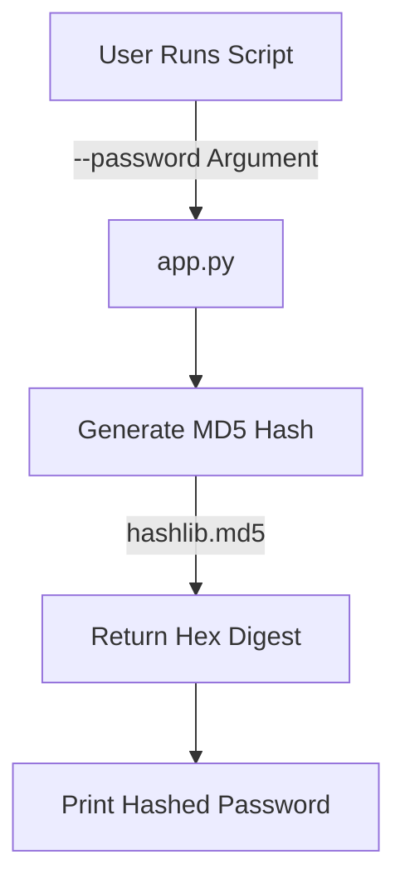

<h1 align="center">🚀 <a href="https://github.com/ronknight/convert-password-md5">Password to MD5 Converter</a></h1>
<h4 align="center">🔧 A Python-based CLI tool to generate MD5 hashes from passwords.</h4>

<p align="center">
  <a href="https://twitter.com/PinoyITSolution"></a>
  <a href="https://github.com/ronknight?tab=followers"></a>
  <a href="https://github.com/ronknight/convert-password-md5/stargazers"></a>
  <a href="https://github.com/ronknight/convert-password-md5/network/members"></a>
  <a href="https://youtube.com/@PinoyITSolution"></a>
  <a href="https://github.com/ronknight/convert-password-md5/issues"></a>
  <a href="https://github.com/ronknight/convert-password-md5/blob/master/LICENSE"></a>
  <a href="https://github.com/ronknight"></a>
</p>

<p align="center">
  <a href="#project-overview">Project Overview</a> •
  <a href="#installation">Installation</a> •
  <a href="#usage">Usage</a> •
  <a href="#example">Example</a> •
  <a href="#visualization">Visualization</a> •
  <a href="#security-note">Security Note</a> •
  <a href="#disclaimer">Disclaimer</a>
</p>

---

## 📌 Project Overview
A command-line utility that converts plain text passwords to MD5 hashes using Python's built-in libraries. Ideal for educational purposes or legacy system support.

---

## ⚙️ Installation
1. Clone the repository:
   ```bash
   git clone https://github.com/ronknight/convert-password-md5.git
   ```
2. Navigate to the project directory:
   ```bash
   cd convert-password-md5
   ```
3. Ensure Python 3 is installed (no external dependencies required).

---

## 🖥️ Usage
Run the script with the `--password` argument:
```bash
python3 app.py --password "your_password_here"
```

### Programmatic Use
Import the hash generator into your Python code:
```python
from app import generate_md5_hash

hashed = generate_md5_hash("secret123")
print(hashed)  # Output: 8743b52063cd84097a65d1633f5c74f5
```

---

## 📋 Example
```bash
$ python3 app.py --password "hello123"
MD5 Hashed Password: 8743b52063cd84097a65d1633f5c74f5
```

---

## 📊 Visualization


---

## 🔒 Security Note
> **Warning**  
> MD5 is cryptographically broken and unsuitable for modern password storage. Use only for:
> - Legacy system compatibility
> - Educational demonstrations
> - Non-sensitive data

---

## ⚠️ Disclaimer
This tool is provided "as-is" for educational purposes. The author assumes no responsibility for:
- Misuse of generated hashes
- Security breaches from MD5 usage
- Data loss or system damage

Always use modern hashing algorithms (e.g., bcrypt, Argon2) in production systems.